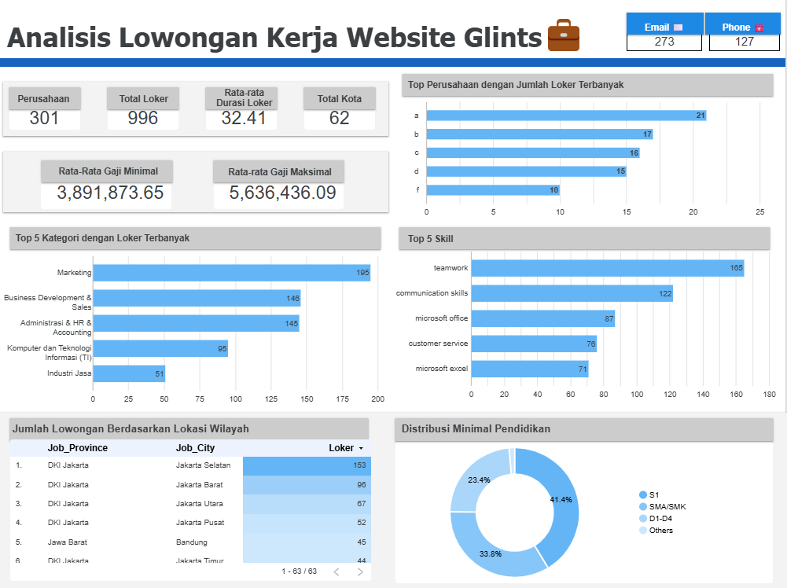

## 📊 GOVOKASi Job Market Insight Dashboard

**Real-world simulation project** from the GOTrainee Tech Program by GOVOKASi (May–June 2025)

### 🔍 Overview

This project involved scraping job and company leads from [Glints.com](https://glints.com/id), preparing the dataset, and developing an interactive dashboard to extract insights about the Indonesian job market.

> 📌 Project Outcome:
>
> * **301 companies** scraped
> * **996 job listings** collected
> * Dashboard reveals top hiring industries, in-demand cities, average salaries, and more.

---

### 🎯 Objectives

* Automate the extraction of company and job data
* Clean and transform raw data into structured format
* Analyze job trends in Indonesia
* Visualize insights in a dynamic and readable format

---

### 🛠️ Tools & Technologies

| Task            | Tools Used                         |
| --------------- | ---------------------------------- |
| Web Scraping    | Python, Selenium, BeautifulSoup    |
| Data Cleaning   | Pandas, Regex                      |
| Visualization   | Looker Studio (Google Data Studio) |
| Documentation   | Jupyter Notebook, Markdown         |
| Project Hosting | GitHub                             |

---

### 📁 Project Structure

```
📁 glints-job-data-pipeline/
├── scraping/
│   └── preprocessing.ipynb
│   └── glints_scrape.ipynb
│   └── df_company_mask.xlsx
│   └── df_company_mask_skill_explode.xlsx
├── dashboard/
│   └── glints_dashboard_looker_studio_link.txt
│   └── dashboard_doc.md
├── README.md 

```

---

### 📈 Dashboard Preview



👉 **Live Dashboard:** [View on Looker Studio](https://lookerstudio.google.com/reporting/e5df4d36-bf6b-4578-af33-133f36761fc4)

---

### 🔑 Key Insights

* 🏙️ Jakarta and Bandung are the top hiring cities
* 💼 Most job openings are in **IT**, **Marketing**, and **Operations**
* 📊 Average salary range: IDR 3–6 million/month


---

### ✅ Skills Practiced

* Data scraping from dynamic websites
* Automating browser actions using Selenium
* Cleaning messy, inconsistent job data
* Aggregating insights from large datasets
* Building dashboards for stakeholder consumption

---

### 👩‍💻 Author

**Aleisya Zahari Salam**
[LinkedIn](https://linkedin.com/in/aleisyazaharisalam) | [GitHub](https://github.com/aleisyazahari)
|  Aspiring Data Analyst & Data Scientist

---

### 📌 Note

This project was developed as part of the **GOVOKASi GOTrainee GoTech program**, not as formal work experience.


